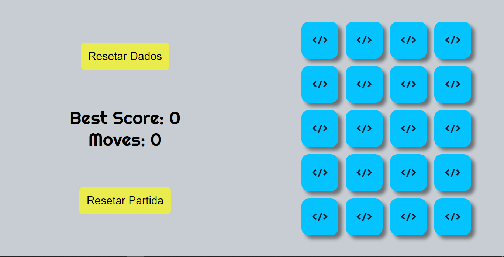
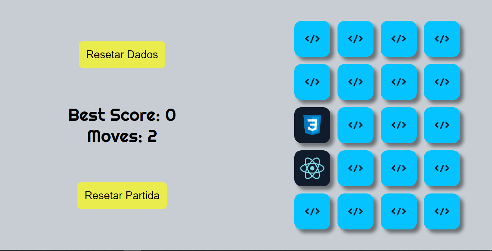
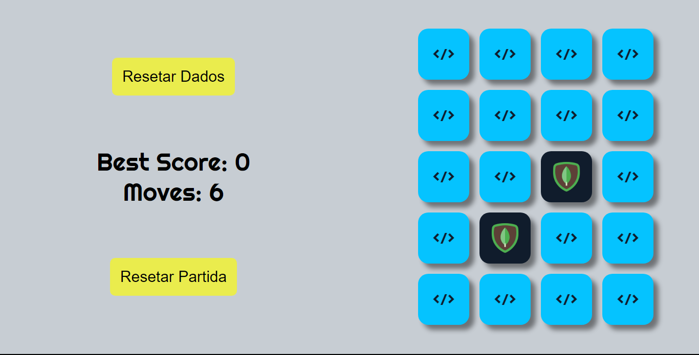
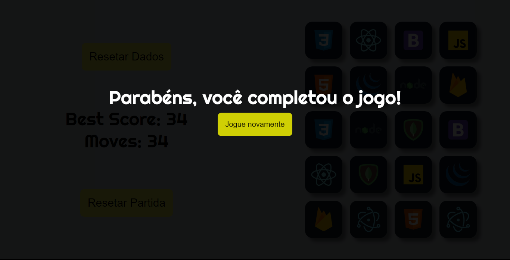
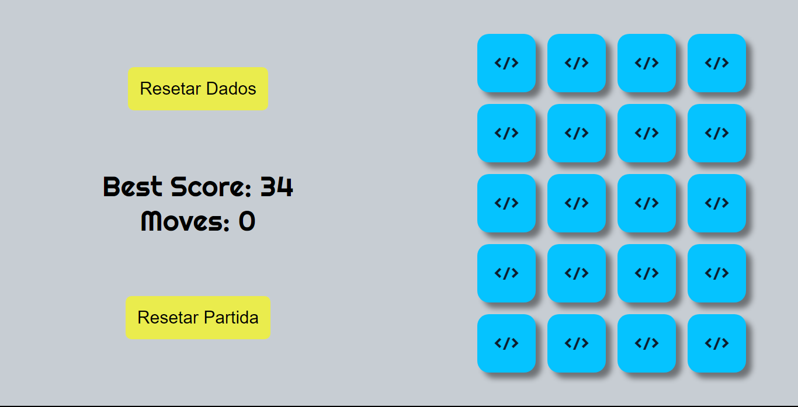
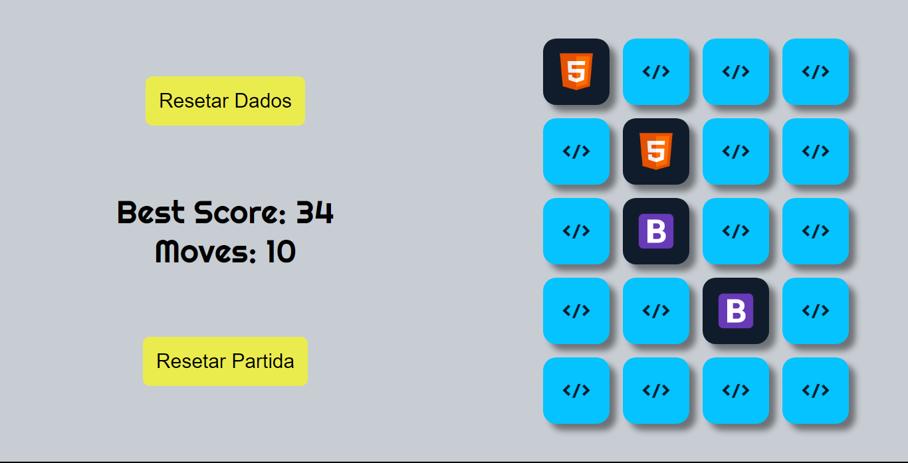
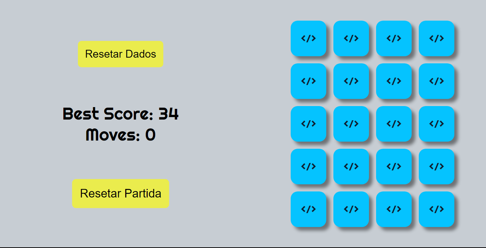
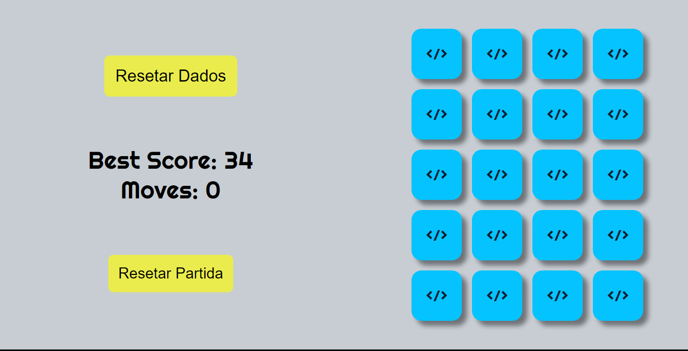

# Jogo da Memória

Jogo feito no curso do ProgramadorBr com alterações minhas.

[Site](https://kaio-matos.github.io/jogo-da-memoria/)

## Tela Inicial

## Cartas que não dão match retornam ao estado  </> + Contador de movimentos

## Cartas que dão match persistem + Contador de movimentos

## Ao finalizar um jogo

## Best Score é mostrado e é armazenado no localStorage

## Resetando partida

Cartas que deram match

Partida resetada

## Resetando o Best Score

### Acrescentado por mim até o momento:

* Best Score
* Contador de movimentos
* Resetar Dados
* Resetar Partida

[Meu Linkedin](https://www.linkedin.com/in/kaio-matos-9532271a5)
